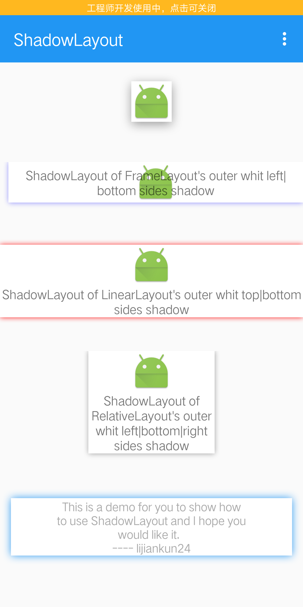

## ShadowLayout
### 关于 ShadowLayout 的使用
先来看一张使用 `ShadowLayout` 库实现的各种阴影的效果图，如下图所示：
<div align=center>
    
</div>


如上图所示，通过使用 `ShadowLayout` 可以控制阴影的颜色、范围、显示边界（上下左右四个边界）、x 轴和 y 轴的偏移量。
### 添加依赖
Gradle:
``` groovy
    compile 'com.lijiankun24:shadowlayout:1.0.0'
```

Maven:
``` groovy
    <dependency>
      <groupId>com.lijiankun24</groupId>
      <artifactId>shadowlayout</artifactId>
      <version>1.0.0</version>
      <type>pom</type>
    </dependency>
```

### 如何使用
在 xml 中添加如下布局文件：
``` xml
    <com.lijiankun24.shadowlayout.ShadowLayout
        android:layout_width="wrap_content"
        android:layout_height="wrap_content"
        android:layout_gravity="center_horizontal"
        android:layout_marginTop="30dp"
        app:shadowColor="#66000000"
        app:shadowDx="0dp"
        app:shadowDy="3dp"
        app:shadowRadius="10dp"
        app:shadowSide="all">

        <ImageView
            android:layout_width="wrap_content"
            android:layout_height="wrap_content"
            android:background="@android:color/white"
            android:contentDescription="@null"
            android:src="@mipmap/ic_launcher"/>
    </com.lijiankun24.shadowlayout.ShadowLayout>
```
上面 xml 布局文件实现的效果如下图所示：
<div align=center>
    
</div>

如上面 xml 中代码显示的那样，总共有 5 个自定义属性，其含义分别如下：
* `app:shadowColor="#66000000"` 控制阴影的颜色，**注意：颜色必须带有透明度的值**
* `app:shadowDx="0dp"` 控制阴影 x 轴的偏移量
* `app:shadowDy="3dp"` 控制阴影 y 轴的偏移量
* `app:shadowRadius="10dp"` 控制阴影的范围
* `app:shadowSide="all|left|right|top|bottom"` 控制阴影显示的边界，共有五个值

欢迎 star 和 fork，也欢迎通过下面二维码下载 APK 体验，如果有什么问题欢迎指出。我的工作邮箱：jiankunli24@gmail.com

<div align=center>
    
</div>
