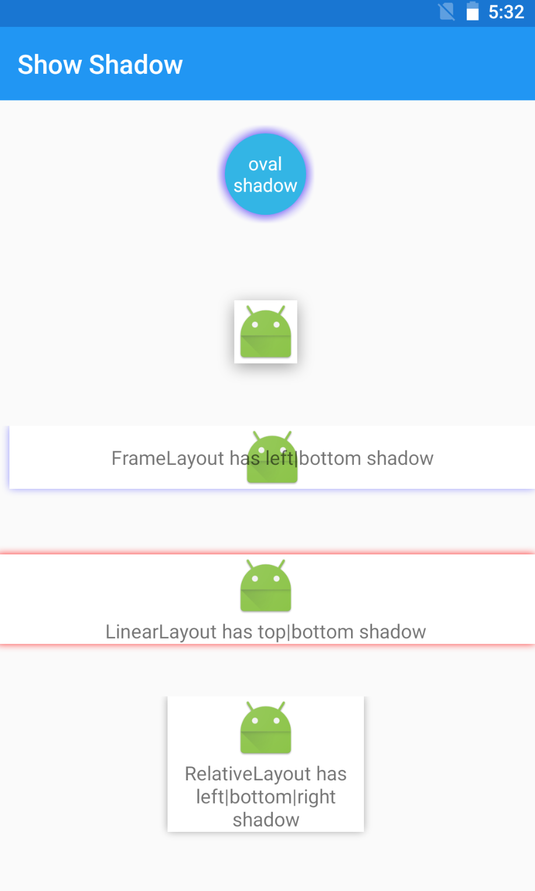
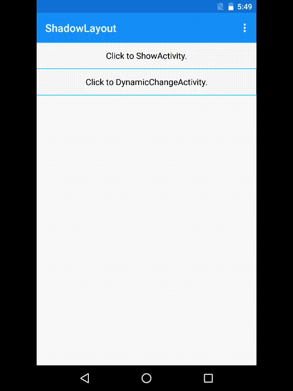

# ShadowLayout

 [  ](https://bintray.com/lijiankun/maven/shadowlayout/_latestVersion)

*Read this in other languages: [中文](README.ch.md), [English](README.md)* 

## Intro

The result of using `ShadowLayout` is as follows：
<div align=center>
    
</div>

By using `ShadowLayout`, you can set the color、shape、radius、display boundary (all|left|right|top|bottom), the offset of the x-axis and the y-axis of shadow.

You can change the color and radius of shadow dynamically, as follows:
<div align=center>
    
</div>

## How to use ShadowLayout

### Setting up the dependency
Gradle:
``` groovy
    implementation 'com.lijiankun24:shadowlayout:x.y.z'
```

Maven:
``` groovy
    <dependency>
      <groupId>com.lijiankun24</groupId>
      <artifactId>shadowlayout</artifactId>
      <version>x.y.z</version>
      <type>pom</type>
    </dependency>
```
>Please replace x and y and z with the latest version numbers:[](https://bintray.com/lijiankun/maven/shadowlayout/_latestVersion)

### Show Shadow
config in xml：
``` xml
    <com.lijiankun24.shadowlayout.ShadowLayout
        android:layout_width="wrap_content"
        android:layout_height="wrap_content"
        android:layout_gravity="center_horizontal"
        android:layout_marginTop="30dp"
        app:shadowColor="#66000000"
        app:shadowShape="rectangle"
        app:shadowDx="0dp"
        app:shadowDy="3dp"
        app:shadowRadius="10dp"
        app:shadowSide="all">

        <ImageView
            android:layout_width="wrap_content"
            android:layout_height="wrap_content"
            android:background="@android:color/white"
            android:contentDescription="@null"
            android:src="@mipmap/ic_launcher"/>
    </com.lijiankun24.shadowlayout.ShadowLayout>
```
The result of above xml is as follows:
<div align=center>
    
</div>

There are 6 properties in xml:
* `app:shadowColor="#66000000"` set the color of shadow，**notice：Color must have a alpha value**
* `app:shadowShape="rectangle|oval"` set the shape of shadow：rectangle|oval
* `app:shadowDx="0dp"` set the shadow x-axis offset
* `app:shadowDy="3dp"` set the shadow y-axis offset
* `app:shadowRadius="10dp"` set the radius of shadow
* `app:shadowSide="all|left|right|top|bottom"` set the display boundary (all|left|right|top|bottom) of shadow

### Change shadow dynamically
``` java
// change the color of shadow
ShadowLayout slOval = findViewById(R.id.sl_oval);
slOval.setShadowColor(ContextCompat.getColor(this, R.color.drak_yellow))

// change the color of shadow
ShadowLayout slRectangle = findViewById(R.id.sl_rectangle)
slRectangle.setShadowColor(Color.parseColor("#EE00FF7F"));

// change the radius of shadow
ShadowLayout slRadius = findViewById(R.id.sl_radius);
slRadius.setShadowRadius(dip2px(12))
```

the result is as follows:
<div align=center>
    
</div>

Welcome to star and fork, and welcome to download the [ShadowLayoutExample.apk](https://github.com/lijiankun24/ShadowLayout/blob/master/ShadowLayoutExample.apk) to experience. if any questions are welcome. My work email: jiankunli24@gmail.com


## License

> ```
> Copyright 2018 lijiankun24
>
> Licensed under the Apache License, Version 2.0 (the "License");
> you may not use this file except in compliance with the License.
> You may obtain a copy of the License at
>
>    http://www.apache.org/licenses/LICENSE-2.0
>
> Unless required by applicable law or agreed to in writing, software
> distributed under the License is distributed on an "AS IS" BASIS,
> WITHOUT WARRANTIES OR CONDITIONS OF ANY KIND, either express or implied.
> See the License for the specific language governing permissions and
> limitations under the License.
> ```
